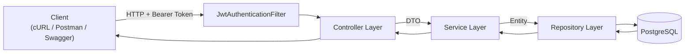
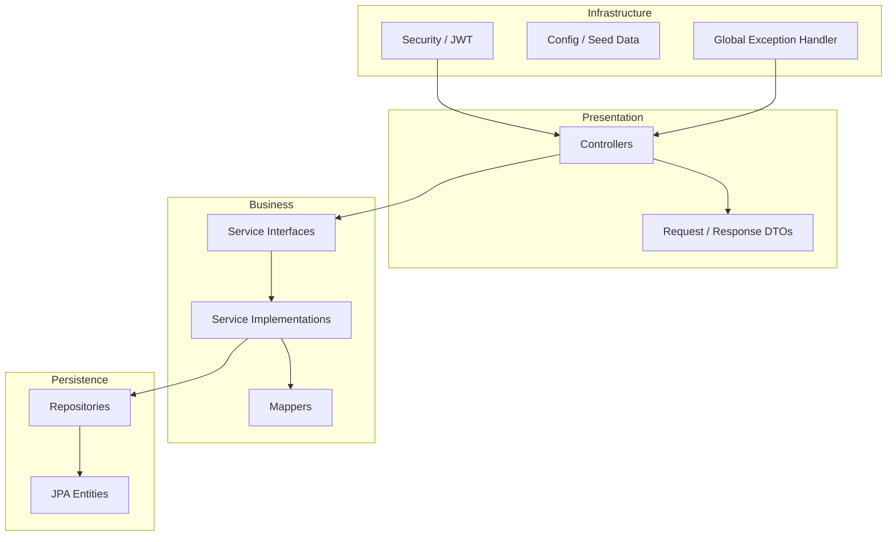
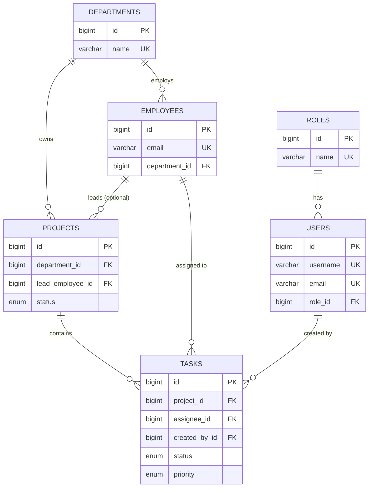

# Employee & Department Management System

[](https://github.com/jaybhavsar555/employee-department-management/actions/workflows/ci.yml)
[](https://openjdk.org/)
[](https://spring.io/projects/spring-boot)
[](https://www.postgresql.org/)
[](https://www.docker.com/)
[](LICENSE)

A production-style **Spring Boot REST API** for managing organizational departments and employees. Built as a hands-on learning project that mirrors real-world backend patterns: JWT authentication, role-based access control, layered architecture, validation, pagination, and Docker-based deployment.

> **Author:** [Jay Bhavsar (@jaybhavsar555)](https://github.com/jaybhavsar555)

---

## Table of Contents

- [Project Overview](#project-overview)
- [Features](#features)
- [Tech Stack](#tech-stack)
- [Architecture Diagram](#architecture-diagram)
- [Folder Structure](#folder-structure)
- [Database Schema](#database-schema)
- [API Documentation](#api-documentation)
- [How to Run](#how-to-run)
- [Docker](#docker)
- [Screenshots](#screenshots)
- [Learning Outcomes](#learning-outcomes)
- [Future Improvements](#future-improvements)
- [License](#license)

---

## Project Overview

The **Employee & Department Management System (EMS)** is a backend service that lets authenticated users create and manage departments and employees through a secure REST API. Departments act as organizational units; each employee belongs to exactly one department.

The application follows a **clean layered architecture** — controllers handle HTTP, services enforce business rules, repositories manage persistence, and DTOs keep the API contract separate from JPA entities. Security is handled with **stateless JWT authentication** and **role-based authorization** (`ROLE_ADMIN`, `ROLE_EMPLOYEE`).

| Aspect | Detail |
|--------|--------|
| **Base URL** | `http://localhost:8080` |
| **API prefix** | `/api/v1` |
| **Interactive docs** | [Swagger UI](http://localhost:8080/swagger-ui.html) |
| **Default admin** | `admin` / `admin123` |

---

## Features

### Authentication & Authorization
- User registration and login with JWT token issuance
- BCrypt password hashing
- Role-based access: **ROLE_ADMIN** can DELETE; **ROLE_EMPLOYEE** can read/create/update
- Refresh token support (`POST /auth/refresh`)
- Stateless session management (no server-side sessions)

### Department Management
- Full CRUD for departments (create, read, update, delete)
- Unique department name validation
- Duplicate and not-found error handling

### Employee Management
- Full CRUD with department assignment
- **Pagination** — configurable page size (default: 10)
- **Sorting** — any employee field (default: `lastName` ascending)
- **Filtering** — by `departmentId` and free-text `search` (first/last name)
- Email uniqueness enforcement
- Salary and hire-date validation

### Cross-Cutting Concerns
- Global exception handler with consistent JSON error responses
- Bean Validation on all request DTOs
- JPA auditing (`createdAt`, `updatedAt`) on all entities
- Seed data: default roles and admin user on startup
- Health check endpoint for monitoring
- OpenAPI 3 / Swagger UI documentation
- Unit tests with JUnit 5, Mockito, and H2 (test profile) — JaCoCo coverage report
- GitHub Actions CI — build, test, package on every push

---

## Tech Stack

| Layer | Technology | Purpose |
|-------|------------|---------|
| **Language** | Java 17+ (21 recommended) | Core runtime |
| **Framework** | Spring Boot 3.3.5 | Application framework |
| **Web** | Spring Web MVC | REST controllers |
| **Security** | Spring Security + JWT (jjwt 0.12.6) | Authentication & authorization |
| **Persistence** | Spring Data JPA + Hibernate | ORM & repositories |
| **Database** | PostgreSQL 16 | Primary data store |
| **Validation** | Jakarta Bean Validation | Request validation |
| **Documentation** | springdoc-openapi 2.6.0 | Swagger / OpenAPI |
| **Build** | Maven (wrapper included) | Dependency & build management |
| **Utilities** | Lombok | Boilerplate reduction |
| **Testing** | JUnit 5, Mockito, H2 | Unit & integration tests |
| **DevOps** | Docker, Docker Compose | Containerized DB & app |

---

## Architecture Diagram

### Request Flow



### Layered Design



### Entity Relationships

See the full **[Relationships (ER diagram)](#relationships-er-diagram)** in the Database Schema section below.

> For a deeper dive into design decisions, see [docs/ARCHITECTURE.md](docs/ARCHITECTURE.md) and [docs/DATABASE_DESIGN.md](docs/DATABASE_DESIGN.md).

---

## Folder Structure

```
employee-department-management/
├── docs/
│   ├── BACKEND_GUIDE.md             # Full backend reference
│   ├── BACKEND_INTERVIEW_GUIDE.md   # Class-by-class interview prep
│   ├── FRONTEND_GUIDE.md            # Flutter admin panel guide
│   ├── ARCHITECTURE.md              # Layer design & rationale
│   ├── DATABASE_DESIGN.md           # Normalization & relationship guide
│   ├── schema.sql                   # Reference SQL schema (incl. projects & tasks)
│   └── screenshots/                 # README screenshots (add your own)
├── .github/workflows/ci.yml         # GitHub Actions — build, test, package
├── src/
│   ├── main/
│   │   ├── java/com/learning/employeedept/
│   │   │   ├── EmployeeDepartmentManagementApplication.java
│   │   │   ├── config/              # Security, Swagger, seed data
│   │   │   │   ├── DataInitializer.java
│   │   │   │   ├── OpenApiConfig.java
│   │   │   │   └── SecurityConfig.java
│   │   │   ├── controller/          # REST endpoints (thin layer)
│   │   │   │   ├── AuthController.java
│   │   │   │   ├── DepartmentController.java
│   │   │   │   ├── EmployeeController.java
│   │   │   │   └── HealthController.java
│   │   │   ├── dto/
│   │   │   │   ├── request/         # Incoming API payloads
│   │   │   │   └── response/        # Outgoing API payloads
│   │   │   ├── entity/              # JPA entities & enums
│   │   │   ├── exception/           # Custom exceptions + @RestControllerAdvice
│   │   │   ├── mapper/              # Entity ↔ DTO conversion
│   │   │   ├── repository/          # Spring Data JPA interfaces
│   │   │   ├── security/            # JWT filter, token service, UserDetails
│   │   │   └── service/             # Business logic (interface + impl)
│   │   └── resources/
│   │       └── application.yml      # App, DB, JWT, Swagger config
│   └── test/
│       ├── java/                    # JUnit 5 + Mockito tests
│       └── resources/
│           └── application-test.yml # H2 in-memory test profile
├── .mvn/wrapper/                    # Maven Wrapper
├── docker-compose.yml               # PostgreSQL service
├── Dockerfile                       # Multi-stage Spring Boot image
├── mvnw / mvnw.cmd                  # Maven Wrapper scripts
├── pom.xml
└── README.md
```

---

## Database Schema

JPA `ddl-auto: update` manages tables automatically in development. The reference SQL below mirrors the production schema defined in [docs/schema.sql](docs/schema.sql).

### Tables

| Table | Description | Key Constraints |
|-------|-------------|-----------------|
| `roles` | User roles (`ROLE_ADMIN`, `ROLE_EMPLOYEE`) | `name` UNIQUE |
| `users` | Application users (API login) | `username`, `email` UNIQUE; FK → `roles` |
| `departments` | Organizational units | `name` UNIQUE |
| `employees` | Staff HR records | `email` UNIQUE; FK → `departments` |
| `projects` | Department-scoped initiatives | FK → `departments`, optional FK → `employees` (lead) |
| `tasks` | Work items within a project | FK → `projects`, optional FK → `employees` (assignee), optional FK → `users` (creator) |

### Relationships (ER diagram)



### Indexes

| Index | Column | Purpose |
|-------|--------|---------|
| `idx_employees_department_id` | `employees.department_id` | Fast department filtering |
| `idx_employees_last_name` | `employees.last_name` | Fast name sorting/search |
| `idx_projects_department_id` | `projects.department_id` | List projects by department |
| `idx_projects_status` | `projects.status` | Filter active/completed projects |
| `idx_tasks_project_id` | `tasks.project_id` | List tasks for a project |
| `idx_tasks_assignee_id` | `tasks.assignee_id` | List tasks assigned to an employee |
| `idx_tasks_project_status_due` | `tasks.project_id, status, due_date` | Sprint board queries |

### Relationships

- **Role** → **User**: One-to-Many (each user has one role)
- **Department** → **Employee**: One-to-Many (each employee belongs to one department)
- **Department** → **Project**: One-to-Many (each project belongs to one department)
- **Employee** → **Project**: One-to-Many as lead (optional project manager)
- **Project** → **Task**: One-to-Many (each task belongs to one project)
- **Employee** → **Task**: One-to-Many as assignee (optional)
- **User** → **Task**: One-to-Many as creator (audit trail)

---

## API Documentation

**Swagger UI:** [http://localhost:8080/swagger-ui.html](http://localhost:8080/swagger-ui.html)  
**OpenAPI JSON:** [http://localhost:8080/api-docs](http://localhost:8080/api-docs)

All protected endpoints require the header:

```
Authorization: Bearer <JWT_TOKEN>
```

### Authentication

| Method | Endpoint | Auth | Description |
|--------|----------|------|-------------|
| `POST` | `/api/v1/auth/register` | Public | Register a new user |
| `POST` | `/api/v1/auth/login` | Public | Login and receive JWT |

**Register request:**
```json
{
  "username": "johndoe",
  "email": "john@example.com",
  "password": "securePass123"
}
```

**Login request:**
```json
{
  "username": "admin",
  "password": "admin123"
}
```

**Auth response:**
```json
{
  "token": "eyJhbGciOiJIUzI1NiJ9...",
  "tokenType": "Bearer",
  "username": "admin",
  "role": "ROLE_ADMIN"
}
```

### Health

| Method | Endpoint | Auth | Description |
|--------|----------|------|-------------|
| `GET` | `/api/v1/health` | Public | Application health check |

**Response:**
```json
{
  "status": "UP",
  "application": "employee-department-management"
}
```

### Departments

| Method | Endpoint | Auth | Description |
|--------|----------|------|-------------|
| `POST` | `/api/v1/departments` | JWT | Create department |
| `GET` | `/api/v1/departments` | JWT | List all departments |
| `GET` | `/api/v1/departments/{id}` | JWT | Get department by ID |
| `PUT` | `/api/v1/departments/{id}` | JWT | Update department |
| `DELETE` | `/api/v1/departments/{id}` | **ADMIN** | Delete department |

**Create / update request:**
```json
{
  "name": "Engineering",
  "description": "Software development team"
}
```

### Employees

| Method | Endpoint | Auth | Description |
|--------|----------|------|-------------|
| `POST` | `/api/v1/employees` | JWT | Create employee |
| `GET` | `/api/v1/employees` | JWT | List employees (paginated) |
| `GET` | `/api/v1/employees/{id}` | JWT | Get employee by ID |
| `PUT` | `/api/v1/employees/{id}` | JWT | Update employee |
| `DELETE` | `/api/v1/employees/{id}` | **ADMIN** | Delete employee |

**Query parameters for `GET /api/v1/employees`:**

| Parameter | Type | Default | Description |
|-----------|------|---------|-------------|
| `page` | int | `0` | Page number (0-indexed) |
| `size` | int | `10` | Page size |
| `sort` | string | `lastName,asc` | Sort field and direction |
| `departmentId` | long | — | Filter by department |
| `search` | string | — | Search first/last name |

**Example:**
```
GET /api/v1/employees?page=0&size=10&sort=lastName,asc&departmentId=1&search=john
```

**Create / update request:**
```json
{
  "firstName": "Jane",
  "lastName": "Smith",
  "email": "jane.smith@company.com",
  "salary": 75000.00,
  "hireDate": "2024-03-15",
  "departmentId": 1
}
```

### Error Response Format

All errors return a consistent JSON body:

```json
{
  "timestamp": "2026-06-28T10:30:00",
  "status": 404,
  "error": "Not Found",
  "message": "Department not found with id: 99",
  "path": "/api/v1/departments/99"
}
```

| HTTP Status | Scenario |
|-------------|----------|
| `400` | Validation failure, bad request |
| `401` | Missing or invalid JWT |
| `403` | Insufficient role (e.g., non-admin DELETE) |
| `404` | Resource not found |
| `409` | Duplicate username, email, or department name |
| `500` | Unexpected server error |

### Quick cURL Example

```bash
# 1. Login
curl -X POST http://localhost:8080/api/v1/auth/login \
  -H "Content-Type: application/json" \
  -d "{\"username\":\"admin\",\"password\":\"admin123\"}"

# 2. Create a department (replace TOKEN)
curl -X POST http://localhost:8080/api/v1/departments \
  -H "Authorization: Bearer TOKEN" \
  -H "Content-Type: application/json" \
  -d "{\"name\":\"Engineering\",\"description\":\"Software team\"}"

# 3. Create an employee
curl -X POST http://localhost:8080/api/v1/employees \
  -H "Authorization: Bearer TOKEN" \
  -H "Content-Type: application/json" \
  -d "{\"firstName\":\"Jane\",\"lastName\":\"Doe\",\"email\":\"jane@company.com\",\"salary\":65000,\"hireDate\":\"2025-01-10\",\"departmentId\":1}"
```

---

## How to Run

### Prerequisites

| Tool | Version | Verify |
|------|---------|--------|
| JDK | 17 or 21 | `java -version` |
| Docker Desktop | Latest | `docker --version` |
| Git | Any recent | `git --version` |

> Maven is **not required** — the project ships with the Maven Wrapper (`mvnw` / `mvnw.cmd`).

### Step 1 — Start PostgreSQL

```bash
docker compose up -d
```

This starts PostgreSQL on port `5432` with:
- Database: `ems_db`
- User: `ems_user`
- Password: `ems_password`

### Step 2 — Run the Application

**Windows:**
```bash
mvnw.cmd spring-boot:run
```

**Linux / macOS:**
```bash
./mvnw spring-boot:run
```

The API is available at **http://localhost:8080**.

### Step 3 — Verify

1. Open **http://localhost:8080/swagger-ui.html**
2. Call `POST /api/v1/auth/login` with `admin` / `admin123`
3. Click **Authorize** in Swagger and paste the JWT token
4. Explore department and employee endpoints

### Run Tests & Coverage

```bash
# Windows
mvnw.cmd test

# View coverage report
# Open target/site/jacoco/index.html
```

Service layer tests: `DepartmentServiceTest`, `EmployeeServiceTest`, `AuthServiceTest` (JUnit 5 + Mockito, AAA pattern).

### Environment Variables

| Variable | Default | Description |
|----------|---------|-------------|
| `JWT_SECRET` | *(see application.yml)* | HMAC secret — **must be ≥ 32 chars in production** |
| `SPRING_DATASOURCE_URL` | `jdbc:postgresql://localhost:5432/ems_db` | Database connection URL |
| `SPRING_DATASOURCE_USERNAME` | `ems_user` | Database username |
| `SPRING_DATASOURCE_PASSWORD` | `ems_password` | Database password |

---

## Docker

### PostgreSQL Only (Development)

The default `docker-compose.yml` runs only the database. The Spring Boot app runs locally on your machine:

```bash
docker compose up -d          # Start PostgreSQL
docker compose down           # Stop PostgreSQL
docker compose down -v        # Stop and remove volumes (reset data)
```

### Full Application Container

Build and run the Spring Boot app as a Docker image:

```bash
# Build the image
docker build -t ems-app .

# Run (ensure PostgreSQL is reachable)
docker run -p 8080:8080 \
  -e SPRING_DATASOURCE_URL=jdbc:postgresql://host.docker.internal:5432/ems_db \
  -e SPRING_DATASOURCE_USERNAME=ems_user \
  -e SPRING_DATASOURCE_PASSWORD=ems_password \
  ems-app
```

> On Linux, replace `host.docker.internal` with your host IP or run PostgreSQL in the same Docker network.

### Docker Compose Services

| Service | Image | Port | Purpose |
|---------|-------|------|---------|
| `postgres` | `postgres:16-alpine` | `5432` | Primary database with health check & persistent volume |
| `backend` | Multi-stage Dockerfile | `8080` | Spring Boot API (waits for healthy postgres) |

### GitHub Actions CI

On every push to `main`/`master`/`develop`:

1. **Checkout** — clone repository
2. **Setup JDK 21** — install Java with Maven cache
3. **Verify** — compile, run tests, JaCoCo coverage
4. **Package** — build runnable JAR
5. **Upload artifact** — store JAR for 7 days

Workflow file: [`.github/workflows/ci.yml`](.github/workflows/ci.yml)

---

## Screenshots

Add your own screenshots to `docs/screenshots/` after running the app locally.

| Screenshot | Description |
|------------|-------------|
| Swagger UI | Interactive API docs at `/swagger-ui.html` |
| Login response | JWT token returned from `/api/v1/auth/login` |
| Department list | `GET /api/v1/departments` response |
| Employee pagination | Paginated `GET /api/v1/employees` with filters |
| Error handling | Validation or 404 error response |

<!-- Uncomment and add images once captured:


-->

**How to capture:**
1. Start the app and open Swagger UI
2. Take screenshots of key endpoints and responses
3. Save as PNG files in `docs/screenshots/`
4. Uncomment the image references above

---

## Learning Outcomes

Working through this project teaches practical backend skills commonly tested in interviews:

| Topic | What You Practice |
|-------|-------------------|
| **Layered Architecture** | Separation of concerns across Controller → Service → Repository |
| **REST API Design** | Resource naming, HTTP verbs, status codes, versioning (`/api/v1`) |
| **Spring Security** | JWT filters, stateless auth, method-level authorization |
| **JPA / Hibernate** | Entity mapping, relationships, lazy loading, auditing |
| **Repository Pattern** | Spring Data JPA, custom queries, pagination |
| **DTO Pattern** | Decoupling API contracts from persistence models |
| **Validation** | Jakarta Bean Validation with meaningful error messages |
| **Exception Handling** | Centralized `@RestControllerAdvice` with consistent errors |
| **SOLID Principles** | Service interfaces, single-responsibility classes |
| **Testing** | Unit tests with Mockito; H2 test profile |
| **DevOps Basics** | Docker Compose for PostgreSQL, multi-stage Dockerfile |
| **API Documentation** | OpenAPI 3 annotations and Swagger UI |

---

## Future Improvements

| Area | Enhancement |
|------|-------------|
| **Refresh tokens** | Long-lived sessions with token rotation ✅ |
| **Audit logging** | Track who created/updated/deleted each record |
| **Soft delete** | Mark records inactive instead of hard deletion |
| **Flyway / Liquibase** | Version-controlled database migrations |
| **Integration tests** | `@SpringBootTest` with Testcontainers for PostgreSQL |
| **Rate limiting** | Protect auth endpoints from brute-force attacks |
| **Email notifications** | Welcome emails on registration, alerts on changes |
| **Frontend UI** | React or Angular admin dashboard |
| **CI/CD pipeline** | GitHub Actions for build, test, and Docker publish ✅ |
| **Kubernetes deployment** | Helm charts for cloud-native scaling |
| **Observability** | Spring Actuator metrics, structured logging, tracing |
| **Multi-tenancy** | Support multiple organizations in one deployment |

---

## License

This project is licensed under the **MIT License** — free to use for learning, portfolio, and interview preparation.

---

<p align="center">
  Built with ☕ and Spring Boot by <a href="https://github.com/jaybhavsar555">Jay Bhavsar</a>
</p>
