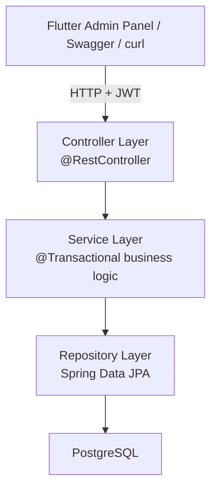
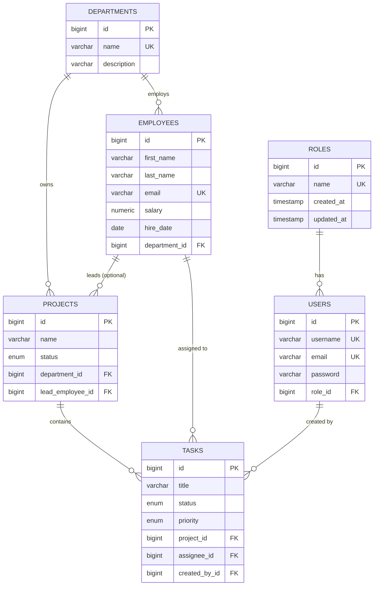
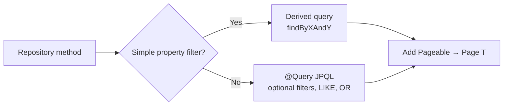
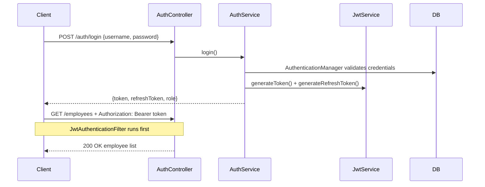

# Backend Guide — Employee & Department Management System

> Complete reference for everything built in the Spring Boot backend: architecture, database design, JPA entities, repositories, security, API, and deployment.

---

## Table of Contents

1. [Tech Stack](#1-tech-stack)
2. [Project Structure](#2-project-structure)
3. [Layered Architecture](#3-layered-architecture)
4. [Entity Relationship (ER) Diagram](#4-entity-relationship-er-diagram)
5. [JPA Entities Explained](#5-jpa-entities-explained)
6. [Spring Data JPA Repositories](#6-spring-data-jpa-repositories)
7. [Query Styles Summary](#7-query-styles-summary)
8. [Pagination Support](#8-pagination-support)
9. [REST API Endpoints](#9-rest-api-endpoints)
10. [JWT Authentication & Security](#10-jwt-authentication--security)
11. [Exception Handling](#11-exception-handling)
12. [Configuration & Database Access](#12-configuration--database-access)
13. [Docker Deployment](#13-docker-deployment)
14. [What's Implemented vs Planned](#14-whats-implemented-vs-planned)

---

## 1. Tech Stack

| Layer | Technology |
|-------|------------|
| Language | Java 17+ (project targets Java 21) |
| Framework | Spring Boot 3.x |
| Persistence | Spring Data JPA + Hibernate |
| Database | PostgreSQL 16 |
| Security | Spring Security + JWT (JJWT) |
| Password hashing | BCrypt |
| API docs | SpringDoc OpenAPI (Swagger UI) |
| Build | Maven (`mvnw.cmd`) |
| Utilities | Lombok |

---

## 2. Project Structure

```
src/main/java/com/learning/employeedept/
├── EmployeeDepartmentManagementApplication.java   # Spring Boot entry point
├── config/
│   ├── SecurityConfig.java          # JWT filter chain, role rules
│   ├── CorsConfig.java              # Allow Flutter web cross-origin calls
│   ├── DataInitializer.java         # Seed roles + default admin user
│   └── OpenApiConfig.java           # Swagger Bearer auth setup
├── controller/                        # REST layer — thin, no business logic
│   ├── AuthController.java
│   ├── DepartmentController.java
│   ├── EmployeeController.java
│   └── HealthController.java
├── dto/
│   ├── request/                     # Incoming JSON bodies (@Valid)
│   └── response/                    # Outgoing JSON (never expose entities)
├── entity/                          # JPA entities mapped to PostgreSQL
├── exception/                       # Custom exceptions + GlobalExceptionHandler
├── mapper/                          # Entity ↔ DTO conversion (MapStruct-style manual)
├── repository/                      # Spring Data JPA interfaces
├── security/
│   ├── JwtService.java              # Create/parse/validate tokens
│   ├── JwtAuthenticationFilter.java
│   └── CustomUserDetailsService.java
└── service/
    ├── AuthService.java             # Interface
    ├── DepartmentService.java
    ├── EmployeeService.java
    └── impl/                        # Business logic implementations
```

**Design rule:** Controllers call Services. Services call Repositories. Entities never leave the service layer — mappers convert to DTOs.

---

## 3. Layered Architecture



| Layer | Responsibility | Example |
|-------|----------------|---------|
| **Controller** | HTTP mapping, status codes, validation trigger | `POST /api/v1/employees` → `employeeService.create()` |
| **Service** | Business rules, transactions, duplicate checks | Block delete if department has employees |
| **Repository** | Database queries only | `findWithFilters(departmentId, search, pageable)` |
| **Entity** | Table mapping, relationships | `Employee` → `employees` table |
| **DTO** | API contract (decoupled from DB schema) | `EmployeeRequest`, `EmployeeResponse` |
| **Mapper** | Convert between entity and DTO | `EmployeeMapper.toResponse(entity)` |

---

## 4. Entity Relationship (ER) Diagram

### Core relationships



### Relationship summary (cardinality)

| From | To | Type | Notes |
|------|-----|------|-------|
| `Role` | `User` | 1 → N | Every user has exactly one role |
| `Department` | `Employee` | 1 → N | Every employee belongs to one department |
| `Department` | `Project` | 1 → N | Projects are department-scoped |
| `Employee` | `Project` | 1 → N | As **lead** (optional FK) |
| `Project` | `Task` | 1 → N | Tasks belong to one project |
| `Employee` | `Task` | 1 → N | As **assignee** (optional) |
| `User` | `Task` | 1 → N | As **creator** (audit trail) |

### Important design decision: User ≠ Employee

- **`User`** = login account for the API (username, password, JWT role).
- **`Employee`** = HR record (salary, hire date, department).
- They are **separate tables** on purpose (Single Responsibility). A future link could add `employee.user_id`, but they are not merged today.

### Foreign key delete behaviors

| Relationship | ON DELETE | Why |
|--------------|-----------|-----|
| `users.role_id → roles` | RESTRICT | Cannot delete a role still assigned to users |
| `employees.department_id → departments` | RESTRICT | Cannot delete department with employees |
| `projects.lead_employee_id → employees` | SET NULL | Project survives if lead leaves |
| `tasks.project_id → projects` | CASCADE | Deleting project removes its tasks |
| `tasks.assignee_id → employees` | SET NULL | Task becomes unassigned if employee removed |

Reference DDL: [`schema.sql`](schema.sql)  
Normalization deep-dive: [`DATABASE_DESIGN.md`](DATABASE_DESIGN.md)

---

## 5. JPA Entities Explained

All entities extend **`BaseEntity`** — shared primary key and audit columns.

### BaseEntity

| Annotation | Purpose |
|------------|---------|
| `@MappedSuperclass` | Not its own table; fields inherited by child entities |
| `@EntityListeners(AuditingEntityListener.class)` | Auto-fills timestamps |
| `@Id` + `@GeneratedValue(IDENTITY)` | PostgreSQL `BIGSERIAL` auto-increment |
| `@CreatedDate` | Set once on insert (`createdAt`) |
| `@LastModifiedDate` | Updated on every save (`updatedAt`) |

Requires `@EnableJpaAuditing` in `SecurityConfig`.

### Entity reference

| Entity | Table | Key fields / relationships |
|--------|-------|---------------------------|
| `Role` | `roles` | `name` enum: `ROLE_ADMIN`, `ROLE_USER` |
| `User` | `users` | `@ManyToOne Role` (EAGER — loaded with user for JWT) |
| `Department` | `departments` | `@OneToMany Employee`, `@OneToMany Project` |
| `Employee` | `employees` | `@ManyToOne Department` (LAZY), `BigDecimal salary` |
| `Project` | `projects` | `@ManyToOne Department`, optional `@ManyToOne Employee lead` |
| `Task` | `tasks` | `@ManyToOne Project`, optional assignee + creator |

### Common JPA annotations used

| Annotation | Meaning |
|------------|---------|
| `@Entity` | Maps class to a database table |
| `@Table(name = "...")` | Explicit table name |
| `@Column(nullable = false, unique = true)` | NOT NULL + UNIQUE constraint |
| `@ManyToOne(fetch = LAZY)` | FK side of relationship; load on demand |
| `@OneToMany(mappedBy = "...")` | Inverse side — FK lives on the other entity |
| `@JoinColumn(name = "...")` | FK column name in DB |
| `@Enumerated(STRING)` | Store enum as `"ACTIVE"` not `0` |
| `@UniqueConstraint` | Composite unique key (e.g. project name per department) |

### Enums

| Enum | Values | Used on |
|------|--------|---------|
| `RoleName` | `ROLE_ADMIN`, `ROLE_USER` | `Role.name` |
| `ProjectStatus` | `PLANNED`, `ACTIVE`, `ON_HOLD`, `COMPLETED`, `CANCELLED` | `Project.status` |
| `TaskStatus` | `TODO`, `IN_PROGRESS`, `IN_REVIEW`, `DONE`, `CANCELLED` | `Task.status` |
| `TaskPriority` | `LOW`, `MEDIUM`, `HIGH`, `CRITICAL` | `Task.priority` |

---

## 6. Spring Data JPA Repositories

Repositories are **interfaces only** — Spring generates implementations at runtime.

Every repository extends:

```java
JpaRepository<Entity, Long>
```

### Inherited methods (free — no code needed)

| Method | Purpose |
|--------|---------|
| `save(entity)` | Insert if new, update if `id` exists |
| `findById(id)` | Returns `Optional<Entity>` |
| `findAll()` | All rows (avoid for large tables — use pagination) |
| `delete(entity)` / `deleteById(id)` | Remove row |
| `count()` | Total row count |
| `existsById(id)` | Boolean existence check |

### Repository inventory

| Repository | Entity | Custom methods |
|------------|--------|----------------|
| `RoleRepository` | `Role` | `findByName`, `existsByName` |
| `UserRepository` | `User` | `findByUsername`, `existsByEmail`, `findByRoleName` + Pageable |
| `DepartmentRepository` | `Department` | `findByNameIgnoreCase`, `findAllByOrderByNameAsc` + Pageable |
| `EmployeeRepository` | `Employee` | `findWithFilters` @Query, `findByDepartmentId` + Pageable |
| `ProjectRepository` | `Project` | `findByDepartmentIdAndStatus`, `findWithFilters` @Query |
| `TaskRepository` | `Task` | `findByProjectIdAndStatus`, overdue finder, `findWithFilters` @Query |

### RoleRepository

| Method | Type | Explanation |
|--------|------|-------------|
| `findByName(RoleName)` | Derived | Load `ROLE_ADMIN` / `ROLE_USER` at startup and registration |
| `existsByName(RoleName)` | Derived | Idempotent seed data check |

### UserRepository

| Method | Type | Explanation |
|--------|------|-------------|
| `findByUsername(String)` | Derived | Login lookup for JWT |
| `findByEmail(String)` | Derived | Email lookup |
| `existsByUsername` / `existsByEmail` | Derived | Duplicate check on register |
| `existsByUsernameAndIdNot` / `existsByEmailAndIdNot` | Derived | Duplicate check on profile update |
| `findByRoleName(RoleName, Pageable)` | Derived + Page | Paginated users by role |
| `countByRoleName(RoleName)` | Derived | Dashboard metric |

### DepartmentRepository

| Method | Type | Explanation |
|--------|------|-------------|
| `findByNameIgnoreCase(String)` | Derived | Case-insensitive name lookup |
| `existsByNameIgnoreCase(String)` | Derived | Prevent duplicate on create |
| `existsByNameIgnoreCaseAndIdNot(...)` | Derived | Update-safe duplicate check |
| `findAllByOrderByNameAsc(Pageable)` | Derived + Page | Paginated list sorted A→Z |
| `countByEmployeesIsNotEmpty()` | Derived | Departments with at least one employee |

### EmployeeRepository

| Method | Type | Explanation |
|--------|------|-------------|
| `existsByEmailIgnoreCase(String)` | Derived | Email unique on create |
| `existsByEmailIgnoreCaseAndIdNot(...)` | Derived | Email unique on update |
| `findByDepartmentId(Long)` | Derived | All employees in department |
| `findByDepartmentId(Long, Pageable)` | Derived + Page | Same, paginated |
| `findByEmailIgnoreCase(String)` | Derived | Exact email lookup |
| `findWithFilters(...)` | @Query JPQL + Page | Powers `GET /employees` with search + department filter |
| `countByDepartmentId(Long)` | Derived | Employee count per department |

### ProjectRepository (ready for future API)

| Method | Type | Explanation |
|--------|------|-------------|
| `findByDepartmentId(..., Pageable)` | Derived + Page | Projects in one department |
| `findByStatus(..., Pageable)` | Derived + Page | Filter by lifecycle status |
| `findByDepartmentIdAndStatus(...)` | Derived + Page | Combined filter |
| `findByLeadId(..., Pageable)` | Derived + Page | Projects where employee is lead |
| `findByNameIgnoreCaseAndDepartmentId(...)` | Derived | Unique name per department |
| `existsByNameIgnoreCaseAndDepartmentId(...)` | Derived | Duplicate check on create |
| `existsByNameIgnoreCaseAndDepartmentIdAndIdNot(...)` | Derived | Duplicate check on update |
| `findWithFilters(...)` | @Query + Page | Optional dept, status, text search |
| `countByDepartmentId(Long)` | Derived | Project count for department |

### TaskRepository (ready for future API)

| Method | Type | Explanation |
|--------|------|-------------|
| `findByProjectId(..., Pageable)` | Derived + Page | Tasks in a project |
| `findByAssigneeId(..., Pageable)` | Derived + Page | "My tasks" view |
| `findByStatus` / `findByPriority` | Derived + Page | Workflow / priority filters |
| `findByProjectIdAndStatus(...)` | Derived + Page | Kanban column |
| `findByAssigneeIdAndDueDateLessThanAndStatusNot(...)` | Derived | Overdue tasks |
| `countByProjectIdAndStatusNotIn(...)` | Derived | Open task count |
| `findWithFilters(...)` | @Query + Page | Multi-filter admin search |

---

## 7. Query Styles Summary

Spring Data JPA supports three ways to query the database:



### 1. Derived query methods

Spring parses the **method name** into SQL.

**Naming pattern:**

```
find | read | get | query | count | exists
+ By + PropertyName + Operator + And/Or + ...
```

**Examples:**

| Method name | Generated logic |
|-------------|-----------------|
| `findByUsername(String)` | `WHERE username = ?` |
| `findByNameIgnoreCase(String)` | `WHERE LOWER(name) = LOWER(?)` |
| `existsByEmailAndIdNot(email, id)` | `WHERE email = ? AND id <> ?` |
| `findByDepartmentId(Long, Pageable)` | `WHERE department_id = ?` + LIMIT/OFFSET |
| `countByRoleName(RoleName)` | `SELECT COUNT(*) WHERE role.name = ?` |

**Relationship navigation:** `findByRoleName` → `user.role.name` in JPQL.

### 2. `@Query` JPQL

Use when derived naming becomes too long or you need:
- `OR` conditions (search across multiple columns)
- Optional null parameters (`:param IS NULL OR ...`)
- `LIKE` text search

**Example — Employee search:**

```java
@Query("""
    SELECT e FROM Employee e
    WHERE (:departmentId IS NULL OR e.department.id = :departmentId)
      AND (:search IS NULL OR :search = ''
           OR LOWER(e.firstName) LIKE LOWER(CONCAT('%', :search, '%'))
           OR LOWER(e.lastName) LIKE LOWER(CONCAT('%', :search, '%'))
           OR LOWER(e.email) LIKE LOWER(CONCAT('%', :search, '%')))
    """)
Page<Employee> findWithFilters(
    @Param("departmentId") Long departmentId,
    @Param("search") String search,
    Pageable pageable);
```

- JPQL uses **entity names** (`Employee`), not table names (`employees`).
- `:departmentId IS NULL` makes the filter optional — pass `null` to skip it.

### 3. Native SQL (not used yet)

```java
@Query(value = "SELECT * FROM employees WHERE ...", nativeQuery = true)
```

Use only when JPQL cannot express the query (complex DB-specific SQL).

---

## 8. Pagination Support

### Backend (Spring Data)

```java
// Controller receives page params from query string
@GetMapping
public ResponseEntity<Page<EmployeeResponse>> getAll(
    @RequestParam(required = false) Long departmentId,
    @RequestParam(required = false) String search,
    @PageableDefault(size = 10, sort = "lastName", direction = Sort.Direction.ASC)
    Pageable pageable) {
    return ResponseEntity.ok(employeeService.getAll(departmentId, search, pageable));
}
```

**HTTP request:**

```
GET /api/v1/employees?page=0&size=10&sort=lastName,asc&departmentId=1&search=john
```

**Service calls repository:**

```java
employeeRepository.findWithFilters(departmentId, search, pageable)
```

**`Page<T>` response JSON:**

```json
{
  "content": [ { "id": 1, "firstName": "John", ... } ],
  "totalElements": 47,
  "totalPages": 5,
  "size": 10,
  "number": 0,
  "first": true,
  "last": false
}
```

| Field | Meaning |
|-------|---------|
| `content` | Items on this page |
| `totalElements` | Total matching rows |
| `totalPages` | Total pages |
| `number` | Current page index (0-based) |
| `size` | Page size |

### Programmatic Pageable

```java
Pageable pageable = PageRequest.of(0, 10, Sort.by("lastName").ascending());
Page<Employee> page = employeeRepository.findByDepartmentId(1L, pageable);
```

---

## 9. REST API Endpoints

Base URL: `http://localhost:8080/api/v1`

Swagger UI: `http://localhost:8080/swagger-ui.html`

### Authentication (public — no JWT required)

| Method | Path | Description |
|--------|------|-------------|
| POST | `/auth/register` | Create user, returns tokens |
| POST | `/auth/login` | Login, returns access + refresh token |
| POST | `/auth/refresh` | Exchange refresh token for new token pair |

**AuthResponse:**

```json
{
  "token": "eyJhbG...",
  "refreshToken": "eyJhbG...",
  "tokenType": "Bearer",
  "username": "admin",
  "role": "ROLE_ADMIN"
}
```

### Health (public)

| Method | Path | Description |
|--------|------|-------------|
| GET | `/health` | Docker healthcheck ping |

### Departments (JWT required)

| Method | Path | Description |
|--------|------|-------------|
| GET | `/departments` | List all departments |
| GET | `/departments/{id}` | Get one department |
| POST | `/departments` | Create department |
| PUT | `/departments/{id}` | Update department |
| DELETE | `/departments/{id}` | Delete (**ADMIN only**) |

**Business rules:**
- Duplicate department names → 409 Conflict
- Cannot delete department with assigned employees → 400 Bad Request

### Employees (JWT required)

| Method | Path | Description |
|--------|------|-------------|
| GET | `/employees` | Paginated list with `departmentId`, `search`, `page`, `size`, `sort` |
| GET | `/employees/{id}` | Get one employee |
| POST | `/employees` | Create employee |
| PUT | `/employees/{id}` | Update employee |
| DELETE | `/employees/{id}` | Delete (**ADMIN only**) |

**Business rules:**
- Duplicate email → 409 Conflict
- Department must exist → 404 if invalid `departmentId`

### Projects & Tasks

- **Entities + repositories exist**
- **No controllers/services yet** — ready for next phase

---

## 10. JWT Authentication & Security

### Auth flow



### Token types

| Token | Lifetime (default) | Used for |
|-------|-------------------|----------|
| **Access token** | 24 hours (`86400000` ms) | Every protected API call |
| **Refresh token** | 7 days (`604800000` ms) | Only `POST /auth/refresh` |

Both tokens include a custom claim `"type": "access"` or `"refresh"`.

**Security rule:** Refresh tokens are **rejected** on protected routes — only access tokens authenticate API calls.

### JwtService key methods

| Method | Purpose |
|--------|---------|
| `generateToken(UserDetails)` | Create short-lived access token |
| `generateRefreshToken(UserDetails)` | Create long-lived refresh token |
| `extractUsername(token)` | Read `sub` claim |
| `isAccessToken(token)` | Verify `type == access` |
| `isRefreshToken(token)` | Verify `type == refresh` |
| `isTokenValid(token, userDetails)` | Not expired + username matches |

### JwtAuthenticationFilter (runs on every request)

1. Read `Authorization: Bearer <jwt>` header
2. Extract username from JWT
3. Load `UserDetails` from database
4. Validate: must be **access** token, not expired, username matches
5. Set `SecurityContextHolder` authentication → Spring knows the user + roles

### SecurityConfig rules

| Path / Method | Access |
|---------------|--------|
| `/api/v1/auth/**` | Public |
| `/swagger-ui/**`, `/api-docs/**` | Public |
| `GET /api/v1/health` | Public |
| `DELETE /api/v1/**` | **ROLE_ADMIN** only |
| All other `/api/v1/**` | Authenticated (any role) |

**Other settings:**
- CSRF disabled (stateless JWT, not cookie sessions)
- `SessionCreationPolicy.STATELESS` — no server-side HTTP session
- BCrypt password encoder
- CORS enabled for Flutter web

### Default seeded admin

Created by `DataInitializer` on first startup:

| Field | Value |
|-------|-------|
| Username | `admin` |
| Password | `admin123` |
| Role | `ROLE_ADMIN` |

---

## 11. Exception Handling

`GlobalExceptionHandler` maps exceptions to consistent JSON:

```json
{
  "timestamp": "2026-06-28T12:00:00",
  "status": 404,
  "error": "Not Found",
  "message": "Department not found with id: 99",
  "path": "/api/v1/departments/99"
}
```

| Exception | HTTP Status |
|-----------|-------------|
| `ResourceNotFoundException` | 404 |
| `DuplicateResourceException` | 409 |
| `BadRequestException` | 400 |
| `UnauthorizedException` | 401 |
| Validation errors (`@Valid`) | 400 |

---

## 12. Configuration & Database Access

### application.yml highlights

| Setting | Value | Notes |
|---------|-------|-------|
| `spring.jpa.hibernate.ddl-auto` | `update` | Auto-create/update tables in dev |
| `spring.jpa.open-in-view` | `false` | Best practice — no lazy loading in controllers |
| `app.jwt.secret` | env `JWT_SECRET` or default | Must be ≥ 32 chars |
| `server.port` | `8080` | |

### Connect to PostgreSQL

**From host (Docker running):**

```powershell
docker exec -it ems-postgres psql -U ems_user -d ems_db
```

**Connection details:**

| Setting | Value |
|---------|-------|
| Host | `localhost` |
| Port | `5432` |
| Database | `ems_db` |
| User | `ems_user` |
| Password | `ems_password` |

**Useful SQL:**

```sql
\dt                          -- list tables
SELECT * FROM users;
SELECT * FROM employees e JOIN departments d ON e.department_id = d.id;
SELECT * FROM projects;
SELECT * FROM tasks;
```

---

## 13. Docker Deployment

### Current setup (backend + DB only)

```powershell
cd C:\Projects\employee-department-management
docker compose up -d
```

| Service | Container | URL |
|---------|-----------|-----|
| PostgreSQL | `ems-postgres` | `localhost:5432` |
| Spring Boot | `ems-backend` | `http://localhost:8080` |

**Important:** Do not run `.\mvnw.cmd spring-boot:run` while Docker backend is on port 8080 — pick one.

### Run frontend separately

```powershell
cd admin_panel
fvm flutter run -d chrome
```

Frontend talks to `http://localhost:8080/api/v1` (see `AppConstants.apiBaseUrl`).

---

## 14. What's Implemented vs Planned

| Feature | Status |
|---------|--------|
| Auth (register, login, refresh) | ✅ Done |
| JWT + role-based DELETE | ✅ Done |
| Department CRUD API | ✅ Done |
| Employee CRUD API + pagination | ✅ Done |
| JPA entities (incl. Project, Task) | ✅ Done |
| Repositories (incl. Project, Task) | ✅ Done |
| Project/Task REST API | ⏳ Not yet |
| Project/Task Flutter UI | ⏳ Not yet |
| Flyway/Liquibase migrations | ⏳ Dev uses `ddl-auto=update` |
| Frontend in docker-compose | ⏳ Commented out (run Flutter locally) |

---

## Quick Interview Cheat Sheet

1. **Why separate User and Employee?** Auth vs HR concerns; different lifecycles.
2. **Why LAZY on Employee.department?** Avoid loading department on every employee query unless needed.
3. **Why EAGER on User.role?** Role needed immediately for JWT authorities.
4. **Derived vs @Query?** Derived for simple filters; @Query for OR/LIKE/optional params.
5. **Why refresh tokens?** Short access token limits exposure; refresh avoids re-login.
6. **Why open-in-view=false?** Prevents accidental N+1 queries and lazy exceptions in controllers.
7. **Why DTOs?** Hide password hash, internal IDs, and entity graph from API consumers.
