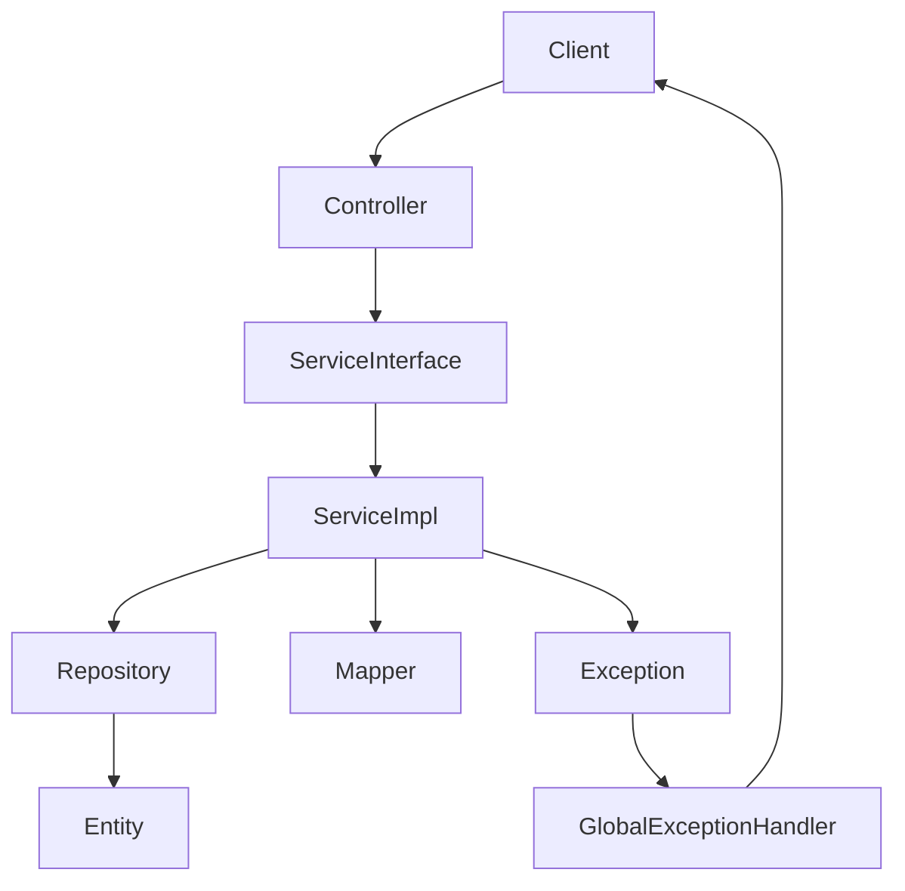
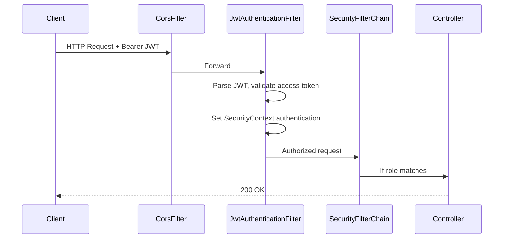

# Backend Interview Guide — Class-by-Class Deep Dive

> Teaching companion for interview preparation. For each major class: **why it exists**, **package placement**, **SOLID**, **OOP**, **Spring concepts**, **interview questions**, **improvements**, **annotations**, and **line-by-line walkthrough**.

See also: [BACKEND_GUIDE.md](BACKEND_GUIDE.md) | [FRONTEND_GUIDE.md](FRONTEND_GUIDE.md)

---

## Table of Contents

1. [Architecture & SOLID Overview](#1-architecture--solid-overview)
2. [REST Best Practices](#2-rest-best-practices)
3. [Logging Levels (SLF4J)](#3-logging-levels-slf4j)
4. [Global Exception Handling — Why Centralize?](#4-global-exception-handling--why-centralize)
5. [Unit Testing — Mocking & AAA](#5-unit-testing--mocking--aaa)
6. [Security Filter Chain](#6-security-filter-chain)
7. [Class Reference (Interview Cards)](#7-class-reference-interview-cards)
8. [Line-by-Line Walkthroughs](#8-line-by-line-walkthroughs)

---

## 1. Architecture & SOLID Overview



| SOLID | Where applied |
|-------|---------------|
| **S** — Single Responsibility | Each service owns one domain; mappers only convert; controllers only handle HTTP |
| **O** — Open/Closed | Add new endpoints via new service methods without modifying repositories |
| **L** — Liskov Substitution | `DepartmentServiceImpl` can replace `DepartmentService` anywhere |
| **I** — Interface Segregation | Separate `AuthService`, `EmployeeService`, `DepartmentService` |
| **D** — Dependency Inversion | Controllers depend on service **interfaces**, not `*Impl` classes |

---

## 2. REST Best Practices

| Practice | Our implementation |
|----------|---------------------|
| Nouns, not verbs | `/departments`, not `/createDepartment` |
| HTTP verbs = actions | GET read, POST create, PUT update, DELETE remove |
| Versioning | `/api/v1/...` |
| Status codes | 201 Created, 204 No Content, 404 Not Found, 409 Conflict |
| `ResponseEntity<T>` | Explicit control over status + body |
| Pagination | `?page=0&size=10&sort=lastName,asc` |
| Filtering | `?departmentId=1&search=john` |
| Stateless auth | JWT in `Authorization: Bearer` header |
| Consistent errors | `ApiErrorResponse` JSON for all failures |

---

## 3. Logging Levels (SLF4J)

We use `@Slf4j` (Lombok generates `log` field).

| Level | When to use | Examples in this project |
|-------|-------------|--------------------------|
| **ERROR** | Unexpected failures needing investigation | `GlobalExceptionHandler` uncaught exceptions |
| **WARN** | Expected failures, auth failures, not-found | Login failed, duplicate email, 404 |
| **INFO** | Business events, lifecycle | CRUD operations, user login, app startup |
| **DEBUG** | Diagnostic detail (dev only) | Pagination query parameters |
| **TRACE** | Very verbose — not used here | — |

**Rule:** Do not log passwords, JWT tokens, or full stack traces to clients. Log stack traces at ERROR server-side only.

---

## 4. Global Exception Handling — Why Centralize?

**Without** `@RestControllerAdvice`:
- Every controller needs try/catch
- Inconsistent error JSON shapes
- Easy to leak stack traces
- HTTP status codes chosen inconsistently

**With** `GlobalExceptionHandler`:
- Services throw domain exceptions (`ResourceNotFoundException`, `DuplicateEmailException`)
- One class maps exception → HTTP status → `ApiErrorResponse`
- Controllers stay thin — no try/catch boilerplate
- Clients always get `{ timestamp, status, error, message, path }`

---

## 5. Unit Testing — Mocking & AAA

### Mocking (Mockito)

**Mock** = fake object replacing a real dependency.

```java
@Mock
private EmployeeRepository employeeRepository;  // Not a real DB

@InjectMocks
private EmployeeServiceImpl employeeService;    // Real class under test
```

When testing `EmployeeServiceImpl.create()`, we **don't** need PostgreSQL. We tell the mock what to return:

```java
when(employeeRepository.existsByEmailIgnoreCase("jane@company.com")).thenReturn(false);
```

### Arrange – Act – Assert (AAA)

```java
@Test
void create_shouldReturnEmployeeResponse() {
    // Arrange — set up input and mock behavior
    EmployeeRequest request = buildRequest();
    when(employeeRepository.existsByEmailIgnoreCase(...)).thenReturn(false);

    // Act — call the method under test
    EmployeeResponse result = employeeService.create(request);

    // Assert — verify outcome
    assertThat(result.getId()).isEqualTo(10L);
    verify(employeeRepository).save(entity);
}
```

### Coverage target

JaCoCo report: `target/site/jacoco/index.html` after `mvn test`.

Service layer (`service.impl`) targets **~72–80%** with unit tests. Controllers are thin — tested via integration tests in a future phase.

---

## 6. Security Filter Chain



| Class | Role |
|-------|------|
| `SecurityConfig` | Defines URL access rules, CSRF off, stateless sessions |
| `JwtAuthenticationFilter` | Reads Bearer token, validates, sets user context |
| `JwtService` | Creates/parses JWT, distinguishes access vs refresh |
| `CustomUserDetailsService` | Loads user + role from DB for Spring Security |

### Roles

| Role | Permissions |
|------|-------------|
| `ROLE_ADMIN` | Full CRUD including DELETE |
| `ROLE_EMPLOYEE` | GET, POST, PUT — no DELETE |

Registration assigns `ROLE_EMPLOYEE` by default. Seed admin gets `ROLE_ADMIN`.

---

## 7. Class Reference (Interview Cards)

Each card answers the 9 interview questions.

---

### `EmployeeServiceImpl`

| # | Answer |
|---|--------|
| **1. Why needed?** | Encapsulates employee business rules: email uniqueness, department validation, pagination |
| **2. Why this package?** | `service.impl` — implementation layer; interface lives in `service` |
| **3. SOLID** | **S** — employee logic only. **D** — implements `EmployeeService` interface |
| **4. OOP** | Encapsulation (private `validateUniqueEmail`), abstraction via interface |
| **5. Spring** | `@Service`, `@Transactional`, constructor injection via `@RequiredArgsConstructor` |
| **6. Interview Q** | "Where do you check duplicate email?" → Service, not controller. "Why `@Transactional`?" → Atomic DB ops |
| **7. Improve** | Extract validation to `@Component EmployeeValidator`; add integration tests |
| **8. Annotations** | `@Slf4j` → logger; `@Service` → Spring bean; `@Transactional` → proxy wraps methods in DB transaction |
| **9. Line-by-line** | See [§8.1](#81-employeeserviceimplcreate) |

---

### `DepartmentServiceImpl`

| # | Answer |
|---|--------|
| **1. Why needed?** | Department CRUD + prevent delete when employees assigned |
| **2. Package** | `service.impl` — same pattern as employee |
| **3. SOLID** | **S** — department domain only. **O** — extend with new rules without changing controller |
| **4. OOP** | Composition — uses `DepartmentRepository` + `DepartmentMapper` |
| **5. Spring** | `@Transactional(readOnly = true)` on reads — Hibernate optimization hint |
| **6. Interview Q** | "Why can't delete department with employees?" → Referential integrity / business rule |
| **7. Improve** | Use `existsByNameIgnoreCaseAndIdNot` (already refactored); add soft delete |
| **8. Annotations** | `@Transactional(readOnly = true)` — no flush/commit on read-only queries |

---

### `AuthServiceImpl`

| # | Answer |
|---|--------|
| **1. Why needed?** | Register, login, refresh — coordinates security + persistence |
| **2. Package** | `service.impl` — auth is a separate domain from HR data |
| **3. SOLID** | **S** — authentication only. **D** — depends on `JwtService` abstraction |
| **4. OOP** | Delegation — password check delegated to `AuthenticationManager` |
| **5. Spring** | Uses `AuthenticationManager`, `PasswordEncoder`, `@Transactional` on register |
| **6. Interview Q** | "Why BCrypt?" → Adaptive hashing, salt built-in. "Access vs refresh token?" → Short vs long lifetime |
| **7. Improve** | Token blacklist on logout; rate limit login |
| **8. Annotations** | `@Service`, `@Slf4j`, `@RequiredArgsConstructor` |

---

### `AuthController`

| # | Answer |
|---|--------|
| **1. Why needed?** | HTTP adapter for auth — maps JSON to service calls |
| **2. Package** | `controller` — presentation/REST layer |
| **3. SOLID** | **S** — HTTP only, zero business logic. **D** — depends on `AuthService` interface |
| **4. OOP** | No inheritance — composition with injected service |
| **5. Spring** | `@RestController`, `@PostMapping`, `@Valid`, `ResponseEntity` |
| **6. Interview Q** | "Why 201 for register?" → Resource created. "Why thin controller?" → Testability + SRP |
| **7. Improve** | Add rate limiting annotation |
| **8. Annotations** | `@Valid` triggers Bean Validation on DTO; `@Tag` groups Swagger docs |

---

### `EmployeeController`

| # | Answer |
|---|--------|
| **1. Why needed?** | Expose employee REST API with pagination params |
| **2. Package** | `controller` |
| **3. SOLID** | **S** — HTTP mapping only |
| **4. OOP** | Delegates all logic to service |
| **5. Spring** | `@PageableDefault`, `@PreAuthorize("hasRole('ADMIN')")` on DELETE |
| **6. Interview Q** | "How does pagination work?" → Spring resolves `Pageable` from query params |
| **7. Improve** | HATEOAS links in paginated response |
| **8. Annotations** | `@PageableDefault(size=10)` — default when client omits params |

---

### `GlobalExceptionHandler`

| # | Answer |
|---|--------|
| **1. Why needed?** | Single place for exception → HTTP response mapping |
| **2. Package** | `exception` — cross-cutting concern |
| **3. SOLID** | **S** — error translation only. **O** — add new `@ExceptionHandler` without changing controllers |
| **4. OOP** | Polymorphism — each exception type handled by specific method |
| **5. Spring** | `@RestControllerAdvice` — AOP across all controllers |
| **6. Interview Q** | "Difference vs try/catch in controller?" → DRY, consistency |
| **7. Improve** | Add error codes enum; i18n messages |
| **8. Annotations** | `@ExceptionHandler(X.class)` — routes exception type to method |

---

### `JwtAuthenticationFilter`

| # | Answer |
|---|--------|
| **1. Why needed?** | Stateless auth — validate JWT on every request |
| **2. Package** | `security` — infrastructure/security concern |
| **3. SOLID** | **S** — JWT parsing/validation only |
| **4. OOP** | Extends `OncePerRequestFilter` — template method pattern |
| **5. Spring** | Servlet filter in Security filter chain; `@Component` auto-registration |
| **6. Interview Q** | "What if no Authorization header?" → Filter passes through; SecurityConfig blocks protected URLs |
| **7. Improve** | Extract token from cookie for web apps |
| **8. Annotations** | `@Component`, `@RequiredArgsConstructor` |

---

### `JwtService`

| # | Answer |
|---|--------|
| **1. Why needed?** | Create, parse, validate JWT tokens |
| **2. Package** | `security` |
| **3. SOLID** | **S** — JWT operations only |
| **4. OOP** | Encapsulation — secret key private, public API for generate/validate |
| **5. Spring** | `@Service`, `@Value` for config injection |
| **6. Interview Q** | "Why separate access and refresh?" → Limit exposure; refresh only hits `/auth/refresh` |
| **7. Improve** | RSA asymmetric signing; token blacklist |
| **8. Annotations** | `@Value("${app.jwt.secret}")` — externalized config |

---

### `SecurityConfig`

| # | Answer |
|---|--------|
| **1. Why needed?** | Central security policy — who can access what |
| **2. Package** | `config` — application configuration beans |
| **3. SOLID** | **S** — security wiring only |
| **4. OOP** | Factory pattern — `@Bean` methods create security components |
| **5. Spring** | `@EnableWebSecurity`, `SecurityFilterChain`, `@EnableMethodSecurity` |
| **6. Interview Q** | "Why CSRF disabled?" → Stateless JWT, not cookie sessions |
| **7. Improve** | Environment-specific CORS origins |
| **8. Annotations** | `@EnableJpaAuditing` — co-located with security config (could move to separate class) |

---

### Exception classes

| Class | HTTP Status | When thrown |
|-------|-------------|-------------|
| `ResourceNotFoundException` | 404 | Entity ID not in DB |
| `DuplicateEmailException` | 409 | Email already used |
| `DuplicateResourceException` | 409 | Username/department name duplicate |
| `BadRequestException` | 400 | Business rule violation |
| `ValidationException` | 400 | Service-layer validation |
| `UnauthorizedException` | 401 | Bad login or invalid token |

---

## 8. Line-by-Line Walkthroughs

### 8.1 `EmployeeServiceImpl.create`

```java
@Transactional
public EmployeeResponse create(EmployeeRequest request) {
```
- **`@Transactional`** — Spring opens a DB transaction. If any line throws, all DB changes roll back.
- Method is **public** so Spring's proxy can intercept it.

```java
    validateUniqueEmail(request.getEmail(), null);
```
- Business rule first — fail fast before hitting DB for insert.
- `null` currentId means "create mode" (check all rows).

```java
    Department department = findDepartment(request.getDepartmentId());
```
- Private helper throws `ResourceNotFoundException` if department missing → GlobalExceptionHandler → 404.

```java
    Employee employee = employeeMapper.toEntity(request, department);
    Employee saved = employeeRepository.save(employee);
```
- **Mapper** converts DTO → Entity (trim names, lowercase email).
- **Repository** persists — JPA assigns auto-generated ID.

```java
    log.info("Created employee id={} email={}", saved.getId(), saved.getEmail());
    return employeeMapper.toResponse(saved);
```
- **INFO** log — auditable business event (not DEBUG — this matters in production).
- Return **DTO**, never entity — hides internal graph from API consumer.

---

### 8.2 `JwtAuthenticationFilter.doFilterInternal`

```java
String authHeader = request.getHeader("Authorization");
if (authHeader == null || !authHeader.startsWith("Bearer ")) {
    filterChain.doFilter(request, response);
    return;
}
```
- No token → skip JWT logic. Public endpoints (`/auth/login`) still work.
- Protected endpoints will fail later in `SecurityConfig` (`anyRequest().authenticated()`).

```java
String jwt = authHeader.substring(7);
String username = jwtService.extractUsername(jwt);
```
- Strip `"Bearer "` prefix (7 characters).
- Parse JWT payload — signature verified inside `JwtService`.

```java
if (username != null && SecurityContextHolder.getContext().getAuthentication() == null) {
    UserDetails userDetails = userDetailsService.loadUserByUsername(username);
    if (jwtService.isAccessToken(jwt) && jwtService.isTokenValid(jwt, userDetails)) {
```
- **Must be access token** — refresh tokens rejected on API routes (security).
- Load fresh roles from DB (not only from JWT claims).

```java
        SecurityContextHolder.getContext().setAuthentication(authentication);
    }
}
filterChain.doFilter(request, response);
```
- Store authenticated user in **thread-local** context for this request.
- `@PreAuthorize` and `hasRole('ADMIN')` read from this context.

---

## Docker & CI (Quick Reference)

### Dockerfile stages

| Stage | Purpose |
|-------|---------|
| `build` | Maven compiles and packages JAR |
| `runtime` | JRE-only image — smaller, no source code |

### docker-compose.yml

| Service | Purpose |
|---------|---------|
| `postgres` | Database with healthcheck + persistent volume |
| `backend` | Spring Boot app, waits for healthy postgres |

### GitHub Actions (`.github/workflows/ci.yml`)

| Step | Purpose |
|------|---------|
| Checkout | Clone repo |
| Setup JDK 21 | Match production Java version |
| `mvn verify` | Compile + test + JaCoCo |
| `mvn package` | Build runnable JAR |
| Upload artifact | Store JAR for 7 days |

---

## Quick Reference — All Packages

| Package | Classes | Responsibility |
|---------|---------|----------------|
| `controller` | Auth, Department, Employee, Health | HTTP layer |
| `service` | Interfaces | Business contracts |
| `service.impl` | *ServiceImpl | Business logic |
| `repository` | JpaRepository interfaces | Data access |
| `entity` | JPA entities | DB mapping |
| `dto.request/response` | DTOs | API contract |
| `mapper` | Mappers | Entity ↔ DTO |
| `exception` | Exceptions + Handler | Error handling |
| `security` | JWT, Filter, UserDetails | Authentication |
| `config` | Security, CORS, OpenAPI, Seed | Infrastructure |
