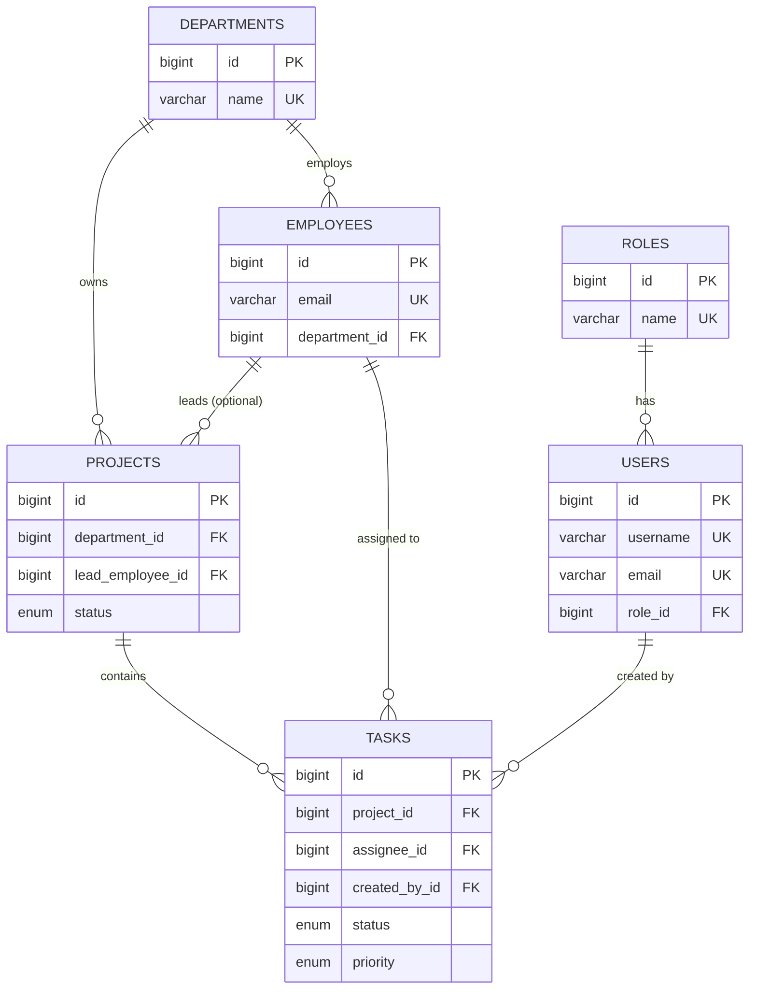

# PostgreSQL Database Design Guide

> Teaching companion to [`schema.sql`](schema.sql). Read this first, then study the SQL.

---

## Entity Relationship Overview

### Relationships (ER diagram)

---

## Normalization Explained

### First Normal Form (1NF)

**Rule:** Each column holds one atomic value; no repeating groups.

| Violation (bad) | Fix (good) |
|-----------------|------------|
| `employees.skills = "Java,SQL,Spring"` | Separate `employee_skills` table |
| Multiple phone columns: `phone1`, `phone2` | `phones` child table |

Our schema: every column is atomic (`first_name`, `salary`, `status`).

### Second Normal Form (2NF)

**Rule:** Must be in 1NF, and every non-key column depends on the **whole** primary key.

Relevant when using **composite primary keys** (e.g., `(project_id, employee_id)` in `project_members`).

Example: if `(project_id, employee_id)` is the PK, then `joined_at` depends on **both** keys — valid 2NF.

We mostly use **surrogate keys** (`BIGSERIAL id`), so 2NF is naturally satisfied.

### Third Normal Form (3NF)

**Rule:** Must be in 2NF, and no non-key column depends on another non-key column (no transitive dependency).

| Violation | Fix |
|-----------|-----|
| `users.role_name = 'ROLE_ADMIN'` stored on user row | Separate `roles` table + `role_id` FK |
| `employees.department_name` duplicated | Only store `department_id`; join when needed |

Our schema removes transitive dependencies:
- Role name → `roles` table
- Department name → `departments` table
- Project belongs to department via FK, not by copying department name onto project

### When to Denormalize (interview bonus)

Sometimes you **intentionally** break 3NF for read performance (e.g., caching `employee_count` on departments). Our app computes `employeeCount` in the mapper instead — correct for learning, trade-off is an extra query or lazy collection load.

---

## Table Reference

| Table | Primary Key | Purpose |
|-------|-------------|---------|
| `roles` | `id` | Authorization roles |
| `users` | `id` | Login accounts (API auth) |
| `departments` | `id` | Organizational units |
| `employees` | `id` | Staff HR records |
| `projects` | `id` | Department-scoped initiatives |
| `tasks` | `id` | Work items within projects |

---

## Keys & Constraints Quick Reference

See inline comments in [`schema.sql`](schema.sql) for full DDL.

### Foreign Key Delete Behaviors (common interview topic)

| Relationship | ON DELETE | Why |
|--------------|-----------|-----|
| `users.role_id → roles` | RESTRICT | Don't delete a role that users still have |
| `employees.department_id → departments` | RESTRICT | Can't delete dept with employees |
| `projects.lead_employee_id → employees` | SET NULL | Project survives if lead leaves |
| `tasks.project_id → projects` | CASCADE | Tasks die with their project |
| `tasks.assignee_id → employees` | SET NULL | Task becomes unassigned |

---

## Index Strategy

| Index | Supports Query |
|-------|----------------|
| `idx_employees_department_id` | Filter employees by department |
| `idx_employees_last_name` | Sort/search by name |
| `idx_projects_status` | Dashboard: active projects |
| `idx_tasks_project_status_due` | Sprint board: open tasks by due date |

**Rule of thumb:** Index columns in `WHERE`, `JOIN`, `ORDER BY`, and FK columns.
