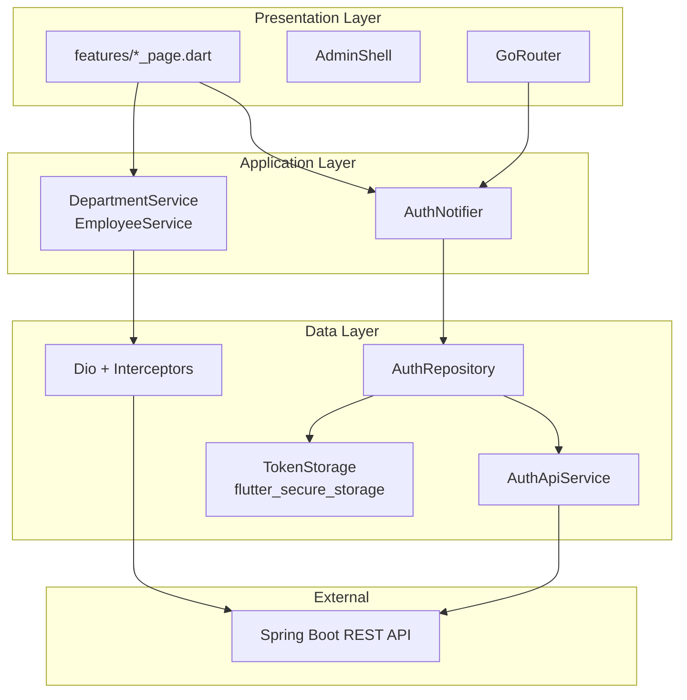
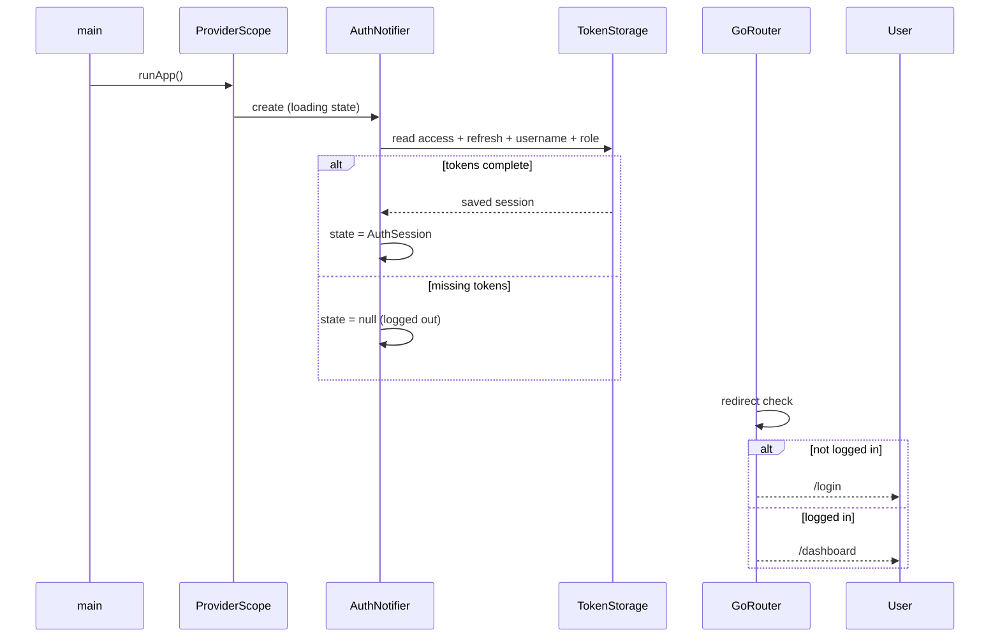
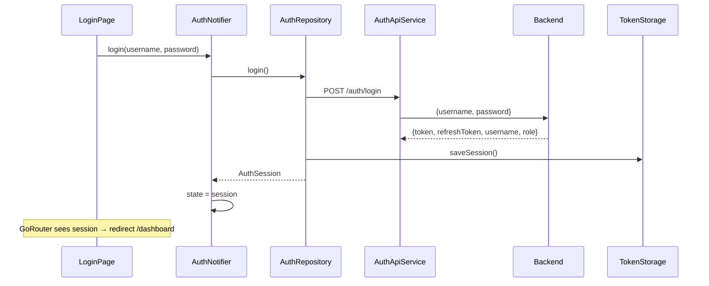
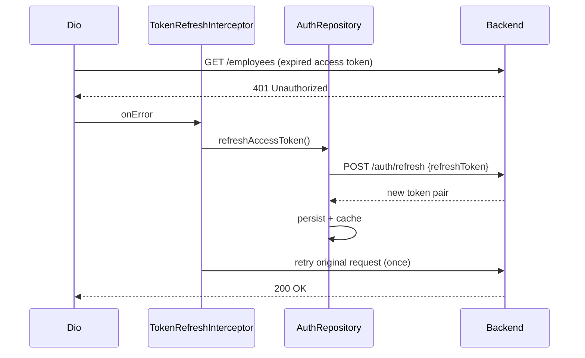
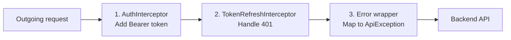
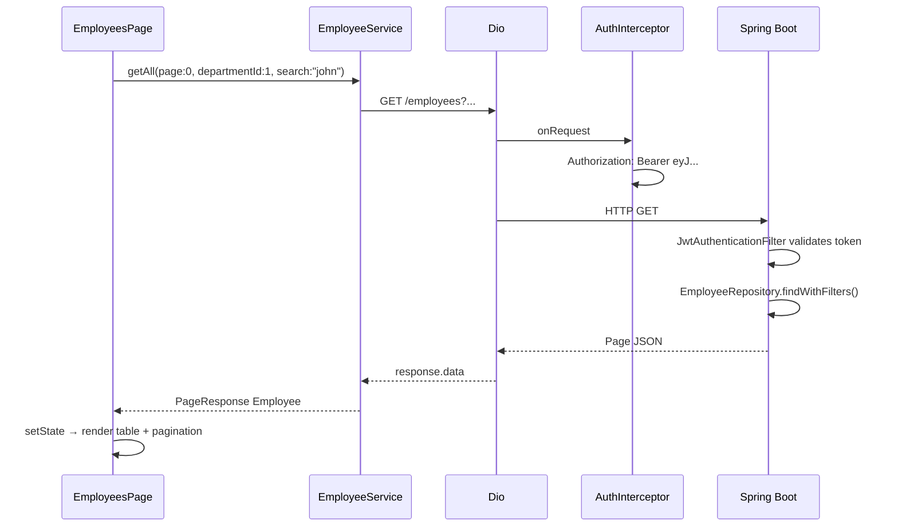

# Frontend Guide — Flutter Web Admin Panel

> Complete reference for the Flutter web admin panel: architecture, auth flow, networking, routing, features, and how it connects to the Spring Boot backend.

---

## Table of Contents

1. [Tech Stack](#1-tech-stack)
2. [Project Structure](#2-project-structure)
3. [Clean Architecture Overview](#3-clean-architecture-overview)
4. [App Startup Flow](#4-app-startup-flow)
5. [Authentication Flow](#5-authentication-flow)
6. [Token Storage & Security](#6-token-storage--security)
7. [HTTP Client & Interceptors](#7-http-client--interceptors)
8. [Routing & Protected Routes](#8-routing--protected-routes)
9. [State Management (Riverpod)](#9-state-management-riverpod)
10. [Feature Pages](#10-feature-pages)
11. [Models & API Mapping](#11-models--api-mapping)
12. [Error Handling](#12-error-handling)
13. [Theme & Layout](#13-theme--layout)
14. [Running the App](#14-running-the-app)
15. [What's Implemented vs Planned](#15-whats-implemented-vs-planned)

---

## 1. Tech Stack

| Layer | Package | Purpose |
|-------|---------|---------|
| UI | Flutter (Material 3) | Cross-platform UI; targets **web** (Chrome) |
| State | `flutter_riverpod` ^2.6 | Dependency injection + reactive state |
| Routing | `go_router` ^15.1 | Declarative routes + redirects |
| HTTP | `dio` ^5.8 | REST client with interceptors |
| Secure storage | `flutter_secure_storage` ^9.2 | Encrypted token persistence |
| Formatting | `intl` ^0.20 | Dates, numbers in UI |
| SDK | Dart ^3.12.0 | Matches Flutter stable Docker image |

Location: `admin_panel/` in the monorepo.

---

## 2. Project Structure

```
admin_panel/lib/
├── main.dart                          # App entry — ProviderScope + MaterialApp.router
├── router/
│   └── app_router.dart                # GoRouter + auth redirect logic
├── theme/
│   └── app_theme.dart                 # Material 3 light theme
├── core/
│   ├── constants/
│   │   ├── app_constants.dart         # API base URL
│   │   └── storage_keys.dart          # Secure storage key names
│   ├── exceptions/
│   │   └── api_exception.dart         # Typed API errors
│   ├── network/
│   │   ├── auth_interceptor.dart      # Attach JWT to requests
│   │   ├── token_refresh_interceptor.dart  # 401 → refresh → retry
│   │   ├── token_storage.dart         # Read/write tokens securely
│   │   └── dio_error_mapper.dart      # DioException → ApiException
│   └── providers/
│       ├── app_providers.dart         # Dio, storage, services DI
│       └── auth_provider.dart         # Login/logout/session state
├── models/
│   ├── auth_response.dart             # Login API response
│   ├── auth_session.dart              # In-app logged-in user (no tokens in UI)
│   ├── department.dart
│   └── employee.dart                  # Includes PageResponse for pagination
├── services/
│   ├── auth_api_service.dart          # Standalone Dio for /auth (no JWT)
│   ├── department_service.dart        # CRUD /departments
│   └── employee_service.dart          # CRUD /employees + pagination
├── repositories/
│   └── auth_repository.dart           # Auth API + storage combined
├── features/
│   ├── auth/login_page.dart
│   ├── dashboard/dashboard_page.dart
│   ├── departments/departments_page.dart
│   └── employees/employees_page.dart
└── shared/widgets/
    ├── admin_shell.dart               # Sidebar / drawer layout
    └── common_widgets.dart            # Reusable UI (dialogs, loading, etc.)
```

**Design rule:** UI widgets → Providers/Services → Dio → Backend API.  
UI never calls Dio directly except through services/repositories.

---

## 3. Clean Architecture Overview



### Layer responsibilities

| Layer | Folder | Responsibility |
|-------|--------|----------------|
| **Presentation** | `features/`, `shared/` | Widgets, forms, navigation |
| **Application** | `core/providers/`, `services/` | State, orchestration, API calls |
| **Data** | `repositories/`, `core/network/` | Tokens, HTTP, persistence |
| **Models** | `models/` | JSON serialization, DTOs |

### Why Repository for auth but Service for departments?

- **AuthRepository** combines API + secure storage + in-memory token cache — multiple data sources.
- **DepartmentService / EmployeeService** are thin API wrappers — one Dio client, no local persistence.

Both patterns are valid; auth is complex enough to warrant a repository.

---

## 4. App Startup Flow



### main.dart

1. `WidgetsFlutterBinding.ensureInitialized()` — required before plugins.
2. `ProviderScope` — Riverpod root container.
3. `ref.watch(dioProvider)` — eagerly creates Dio + interceptors.
4. `ref.watch(routerProvider)` — GoRouter with auth redirect.
5. `MaterialApp.router` — uses GoRouter instead of `Navigator 1.0`.

---

## 5. Authentication Flow

### Login



### Token refresh (automatic on 401)



### Logout

1. User taps Sign out in `AdminShell`.
2. `AuthNotifier.logout()` → `AuthRepository.logout()`.
3. Clears in-memory cache + secure storage.
4. `authStateProvider` → `null`.
5. GoRouter redirect → `/login`.

---

## 6. Token Storage & Security

### What is stored

| Key (`storage_keys.dart`) | Content |
|---------------------------|---------|
| Access token | Short-lived JWT for API calls |
| Refresh token | Long-lived JWT for `/auth/refresh` |
| Username | Display in shell header |
| Role | e.g. `ROLE_ADMIN` — UI can hide admin-only actions |

### TokenStorage

Wraps `FlutterSecureStorage`:
- **Web:** uses encrypted local storage (browser-dependent).
- **Mobile/desktop:** platform secure enclaves when built for those targets.

### AuthRepository caching

```dart
String? _cachedAccessToken; // Avoid disk read on every HTTP request
```

Flow:
1. After login/refresh → save to storage + cache.
2. `getAccessToken()` → return cache, else read storage.
3. Logout → clear both.

### Session restore rules

On app start, **all four** values must exist (access, refresh, username, role).  
If any is missing → wipe storage → treat as logged out. Prevents half-broken sessions.

---

## 7. HTTP Client & Interceptors

### Two Dio instances (important)

| Client | Used by | JWT attached? |
|--------|---------|---------------|
| **AuthApiService** (own Dio) | Login, refresh | No — would cause circular dependency |
| **dioProvider** (shared Dio) | Departments, employees | Yes — via interceptors |

### API base URL

```dart
// app_constants.dart
static const apiBaseUrl = String.fromEnvironment(
  'API_BASE_URL',
  defaultValue: 'http://localhost:8080/api/v1',
);
```

Override at build time:

```powershell
flutter run -d chrome --dart-define=API_BASE_URL=http://localhost:8080/api/v1
```

### Interceptor chain (order matters)



#### 1. AuthInterceptor

- Runs **before** every request on shared Dio.
- Reads access token from `AuthRepository`.
- Sets header: `Authorization: Bearer <token>`.

#### 2. TokenRefreshInterceptor

- Extends `QueuedInterceptor` — serializes concurrent 401s (one refresh at a time).
- On 401:
  - Skip if path contains `/auth/` (login failure).
  - Skip if already retried (`x-token-retried` header).
  - Call `refreshAccessToken()`.
  - Retry original request **once** with new token.
- If refresh fails → error propagates → user must log in again.

#### 3. Error wrapper

- Parses Spring Boot error JSON: `{ "message": "...", "path": "..." }`.
- Wraps in `ApiException` for consistent UI error display.

---

## 8. Routing & Protected Routes

### Route map

| Path | Widget | Auth required |
|------|--------|---------------|
| `/login` | `LoginPage` | No |
| `/dashboard` | `DashboardPage` | Yes |
| `/departments` | `DepartmentsPage` | Yes |
| `/employees` | `EmployeesPage` | Yes |

Protected routes are wrapped in **`ShellRoute`** → `AdminShell` (sidebar + logout).

### Redirect logic (`app_router.dart`)

```
if still bootstrapping (loading tokens) → wait, no redirect
if session == null && not on /login → redirect to /login
if session != null && on /login → redirect to /dashboard
else → allow navigation
```

### AuthRefreshListenable

GoRouter does not watch Riverpod by default.  
`_AuthRefreshListenable` listens to `authStateProvider` and calls `notifyListeners()` so redirect re-runs on login/logout.

---

## 9. State Management (Riverpod)

### Key providers

| Provider | Type | Purpose |
|----------|------|---------|
| `secureStorageProvider` | Provider | `FlutterSecureStorage` singleton |
| `tokenStorageProvider` | Provider | Token read/write wrapper |
| `authApiServiceProvider` | Provider | Auth-only HTTP client |
| `authRepositoryProvider` | Provider | Auth API + storage |
| `dioProvider` | Provider | Main HTTP client with interceptors |
| `authStateProvider` | StateNotifierProvider | Login state: loading / session / error |
| `routerProvider` | Provider | GoRouter instance |
| `departmentServiceProvider` | Provider | Department API |
| `employeeServiceProvider` | Provider | Employee API |

### AuthNotifier states

| `AsyncValue` | UI behavior |
|--------------|-------------|
| `loading` | Bootstrapping — router waits |
| `data(null)` | Logged out |
| `data(AuthSession)` | Logged in — show shell |
| `error` | Storage/read failure |

### Why Riverpod?

- Compile-safe provider references.
- Easy testing (override providers).
- `ConsumerWidget` / `ConsumerStatefulWidget` rebuild only when watched providers change.

---

## 10. Feature Pages

### LoginPage (`features/auth/login_page.dart`)

- Username + password form.
- Calls `authNotifier.login()`.
- Shows error SnackBar if login fails.
- On success, router auto-redirects to dashboard.

**Default credentials (backend seed):** `admin` / `admin123`

### DashboardPage

- Welcome screen after login.
- Entry point for admin panel navigation.

### DepartmentsPage

- Lists all departments from `GET /departments`.
- Create / edit / delete dialogs.
- Delete may fail if department has employees (backend 400).

**Service mapping:**

| UI action | HTTP |
|-----------|------|
| Load list | `GET /departments` |
| Create | `POST /departments` |
| Update | `PUT /departments/{id}` |
| Delete | `DELETE /departments/{id}` (admin only) |

### EmployeesPage

Most feature-rich screen — mirrors backend pagination.

**State:**

| State variable | Purpose |
|----------------|---------|
| `_page` | `PageResponse<Employee>` from backend |
| `_currentPage` | 0-based page index (Spring convention) |
| `_departmentFilter` | Optional `departmentId` query param |
| `_searchQuery` | Optional `search` query param |
| `_departments` | Loaded for filter dropdown + create form |

**Service call:**

```
GET /employees?page=0&size=10&sort=lastName,asc&departmentId=1&search=john
```

**UI features:**
- Search box (debounced or on submit)
- Department filter dropdown
- Pagination controls (prev/next, page info)
- Create / edit employee dialog (department required)
- Delete button (visible for admin role — backend enforces anyway)

**Admin-only delete:** UI checks `session.role == 'ROLE_ADMIN'` before showing delete; backend returns 403 if non-admin tries.

---

## 11. Models & API Mapping

### AuthResponse (from backend)

```json
{
  "token": "eyJhbG...",
  "refreshToken": "eyJhbG...",
  "tokenType": "Bearer",
  "username": "admin",
  "role": "ROLE_ADMIN"
}
```

Mapped in `auth_response.dart` with `fromJson` / request DTOs for login and refresh.

### AuthSession (in-app only)

```dart
AuthSession(username: 'admin', role: 'ROLE_ADMIN')
```

Tokens stay in repository/storage — **not** exposed to widgets.

### Department

```json
{
  "id": 1,
  "name": "Engineering",
  "description": "Software team",
  "employeeCount": 5,
  "createdAt": "2026-01-15T10:00:00",
  "updatedAt": "2026-01-15T10:00:00"
}
```

### Employee

```json
{
  "id": 1,
  "firstName": "Jane",
  "lastName": "Doe",
  "email": "jane@company.com",
  "salary": 75000.00,
  "hireDate": "2024-03-01",
  "departmentId": 1,
  "departmentName": "Engineering"
}
```

### PageResponse\<T\> (Spring `Page` JSON)

```json
{
  "content": [ ... ],
  "totalElements": 47,
  "totalPages": 5,
  "size": 10,
  "number": 0,
  "first": true,
  "last": false
}
```

`EmployeeService.getAll()` parses this into `PageResponse<Employee>` with generic `fromJson` callback.

---

## 12. Error Handling

### ApiException

```dart
ApiException(
  message: 'Department already exists: Engineering',
  statusCode: 409,
  path: '/api/v1/departments',
)
```

### Flow

1. Backend returns `{ "message": "...", "status": 409, ... }`.
2. Dio error interceptor wraps as `ApiException`.
3. `dio_error_mapper.dart` used in services as fallback.
4. UI shows `e.message` in SnackBar or error panel.

### Common errors users see

| Status | Cause | Example message |
|--------|-------|-----------------|
| 401 | Wrong password / expired session | Invalid username or password |
| 403 | Non-admin DELETE | Forbidden |
| 404 | Invalid ID | Department not found |
| 409 | Duplicate name/email | Username already exists |
| 400 | Business rule | Cannot delete department with employees |

---

## 13. Theme & Layout

### AppTheme

- Material 3 light theme.
- Blue primary color scheme.
- Consistent padding, card styles, input decoration.

### AdminShell (responsive layout)

| Breakpoint | Layout |
|------------|--------|
| `>= 900px` | Left `NavigationRail` + content |
| `>= 1100px` | Extended rail with labels |
| `< 900px` | Drawer + bottom navigation |

**Navigation destinations:**
- Dashboard → `/dashboard`
- Departments → `/departments`
- Employees → `/employees`

Header shows username + role; Sign out triggers logout.

---

## 14. Running the App

### Prerequisites

1. Backend running (Docker or local Maven).
2. Flutter SDK (project uses FVM optionally).

### Step 1 — Start backend + database

```powershell
cd C:\Projects\employee-department-management
docker compose up -d
```

Verify: `http://localhost:8080/api/v1/health`

### Step 2 — Start Flutter web

```powershell
cd admin_panel
fvm flutter pub get
fvm flutter run -d chrome
```

### URLs

| What | URL |
|------|-----|
| Flutter UI | Chrome (auto-opens) |
| Backend API | http://localhost:8080/api/v1 |
| Swagger | http://localhost:8080/swagger-ui.html |

### Docker frontend (optional, currently disabled)

`admin_panel/Dockerfile` + `nginx.conf` exist for serving built web app.  
`docker-compose.yml` frontend service is commented out — run Flutter locally for dev.

Build for production web:

```powershell
cd admin_panel
flutter build web --dart-define=API_BASE_URL=/api/v1
```

---

## 15. What's Implemented vs Planned

| Feature | Status |
|---------|--------|
| Login + session restore | ✅ Done |
| JWT on all API calls | ✅ Done |
| Automatic token refresh on 401 | ✅ Done |
| Protected routes (GoRouter) | ✅ Done |
| Dashboard | ✅ Done |
| Departments CRUD UI | ✅ Done |
| Employees CRUD + pagination + search | ✅ Done |
| Admin-only delete in UI | ✅ Done |
| Projects UI | ⏳ Not yet (backend entities/repos ready) |
| Tasks UI | ⏳ Not yet |
| Register page | ⏳ API exists; no UI |
| Refresh token rotation UI feedback | ⏳ Silent refresh only |

---

## End-to-End Request Example

**User searches employees in Engineering department:**



---

## Quick Interview Cheat Sheet

1. **Why two Dio instances?** Auth endpoints must not use the JWT interceptor (chicken-and-egg at login).
2. **Why Repository for auth?** Coordinates API + secure storage + memory cache — single source of truth for tokens.
3. **Why QueuedInterceptor for refresh?** Prevents multiple parallel refresh calls when many requests fail with 401 at once.
4. **Why GoRouter + Riverpod listenable?** Router needs to re-evaluate redirects when auth state changes without manual `Navigator.push`.
5. **Why flutter_secure_storage?** Tokens should not live in plain `SharedPreferences`.
6. **Why PageResponse model?** Mirrors Spring `Page<T>` JSON exactly — `content`, `totalElements`, `number`.
7. **Why `--dart-define=API_BASE_URL`?** Same codebase builds for local dev vs Docker/nginx proxy without code changes.
